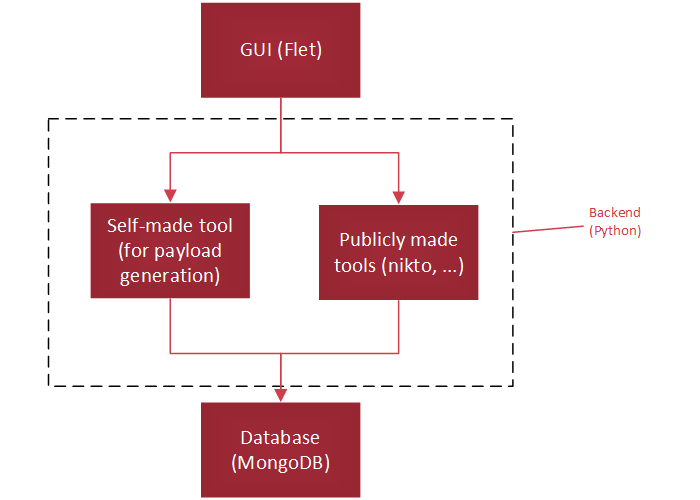
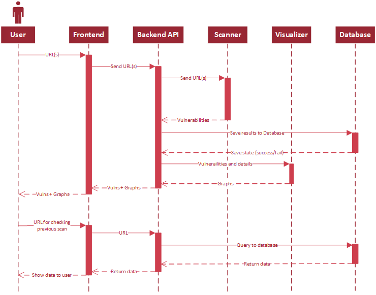

# webvuln
A website vulnerability scanner.
## Technology Stack
- Python
- MongoDB
- Flet (for GUI)
- Other tools (nikto, dirsearch, ...)
## Structure

## Data Sequence Diagram

## Report:
[Here](https://docs.google.com/document/d/1q2712vtjwxAC53eEqRq5TR32uh3Rn8zE73PcZUIBzOs/edit?usp=sharing)