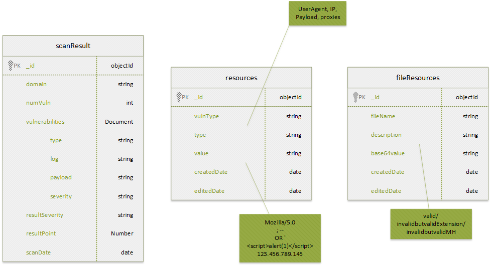

# webvuln
A website vulnerability scanner for coders without any knowledge of web security.
## Technology Stack
- Python 
- Flask (for API - run on localhost)
- MongoDB
- Flutter (for GUI)
- Enumeration tools (dirsearch, ffuf, etc.)
## Use Cases
- Scan a domain or list of domains from input/CSV/JSON file(s)
- Choose modules to scan
- See the scan history
- Add/remove payloads and other resources to the database using CSV/JSON file(s)
- Send a notification when the scan is complete (not done)
- Analyze using bar/pie charts, click on the chart to show more details (not done)
- Add self-written modules
- Export a report in PDF/XML/JSON format
## System Architecture

## Database Schema

## Data Sequence Diagram

## Flask Webserver (API for GUI - run on localhost)

## Report:
[Here](https://docs.google.com/document/d/1q2712vtjwxAC53eEqRq5TR32uh3Rn8zE73PcZUIBzOs/edit?usp=sharing)
## Figma
[Here](https://www.figma.com/file/GaYOiOhGOmMFxXdlmdPTDr/Project-Scanner-website?type=design&node-id=0-1&mode=design)
## Install for pdfkit-generate report as PDF
https://github.com/JazzCore/python-pdfkit/wiki/Installing-wkhtmltopdf                                      
- Guide: https://www.youtube.com/watch?v=XX9nhxVF8Z4
## How to run
- Install Docker
- Run `docker-compose up` at the `source\\core\\database` directory
- Add mongoURI to the `.env_example` file at the root directory and rename it to `.env`
- Run `setup.py` file to add all resources to the database
- Run `webvuln.py` file to start the API server and backend
